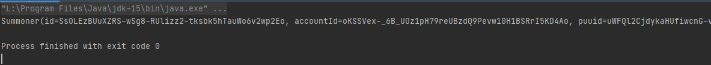

ktor lol 사용법
======================
# 1. Application.kt
*****
## (1단계) 1.1 전역 변수 설정
> * API_KEY 를 만료되지 않은 키로 설정해 줍니다.
> * val requestURL 을 원하는 URL 로 지정합니다.
### 예시
```kotlin
// 1. API 필요한 키
val API_KEY = "RGAPI-f1938eab-5f3c-4b1b-a84f-82030da5961d"

// 2. URL 나누어서 작성
val URL = "https://kr.api.riotgames.com" // 도메인
val SUMMONER_V4 = "/lol/summoner/v4/summoners" // 소환사_V4를 요청함
val BY_NAME = "/by-name/" // 소환사명으로 조회하겠음
```
*****
## (2단계) 1.2 main() 지역 변수 및 실행
> * requestURl의 작성
> * 요청된 결과가 response 객체에 담기며 이는 Summoner 클래스의 인스턴스이다. 이제 Summoner 객체를 이용하면 된다.
> * main() 함수를 실행시킨다. 
### 예시
```kotlin
// 1. requestURL 작성
val requestURL = "$URL$SUMMONER_V4$BY_NAME$summonerName"

// 2. 요청한 결과
// 비동기
val response: Summoner = client.get(requestURL) {
        header("X-Riot-Token", API_KEY)
}
```
*****
## (3단계) 1.3 결과 보기
```kotlin
println(response)
```
